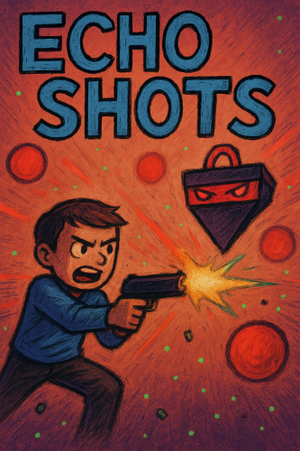

# Echo Shots 🔫👾

<div align="center">
   <h1><a href="https://ruuroger.itch.io/echo-shots">Play on itch.io 🎮</a></h1>
</div>

<p align="center">
  
</p>

## Language / Idioma
- [English](#english)
- [Castellano](#castellano)

## English

## Current Version

**2.0.0**

### Main Changes
- Complete code refactor.
- In-game sound: background music, shooting effects, and item sounds.
- Now, ammunition is collected by the player’s hit, not by the gun.
- Difficulty adjusted: all bullets now reduce the same amount of health, and the player has more lives

---

## Table of Contents
- [Description](#description)
- [Download](#download)
- [Controls](#controls)
- [Credits](#credits)
- [Licence}](#licence)
- [Contact](#contact)

---

## Description

In Echo Shots, every bullet counts. Armed with your weapon and 12 bullets, you must defeat your enemy while dodging every bullet coming your way (including your own!).
Show your reflexes and strategy to win.

## Download

Clone the repository with:

```bash
git clone https://github.com/RuuRoger/Echo-Shots.git
```

## Controls
- Movement: AWSD or Arrows
- Shoot: Left mouse click

## Credits
- Gameplay developer: RuuRoger
- Pixel Art: RuuRoger

## Licence

This project is licensed under the Creative Commons Attribution-NonCommercial 4.0 International (CC BY-NC 4.0) License.

See https://creativecommons.org/licenses/by-nc/4.0/ for more information.

## Contact
- Email: **lozanofierroruu@gmail.com**

---

## Castellano

## Versión Actual

**2.0.0**

### Cambios Principales
- Refactoriado todo el código
- Sonido para los disparos, música de batalla y de items.
- Ahora la munición se coge con el 'hit' del player, no del arma.
- Se ha ajustado la dificultad, equilbrando el valor respecto a la vida de las balas y el player dispone de más vida.

---

## Tabla de Contenidos
- [Descripción](#descripcion)
- [Clonar](#clonar)
- [Controles](#controles)
- [Creditos](#creditos)
- [Licencia}](#licenceia)
- [Contacto](#contacto)

---

## Description

En Echo Shots, cada bala cuenta. Equipado con tu arma y 12 balas, deberás derrotar a tu enemigo, esquivando cada bala hacia a tí (¡incluida las tuyas!).
Demuestra tus reflejos y tu estrategia para ganar.

---

## Clonar

Clona el repositorio con:

```bash
git clone https://github.com/RuuRoger/Echo-Shots.git
```

## Controles
- Movimiento: AWSD o flechas
- Disparo: Botón izquierdo del botón

## Creditos
- Desarrollador Gamplay: RuuRoger
- Pixel Art: RuuRoger

## Licence

Este proyecto está licenciado bajo la Licencia **Creative Commons Atribución-NoComercial 4.0 Internacional (CC BY-NC 4.0)**.

Para más información:  https://creativecommons.org/licenses/by-nc/4.0/ 

## Contact
- Email: **lozanofierroruu@gmail.com**
